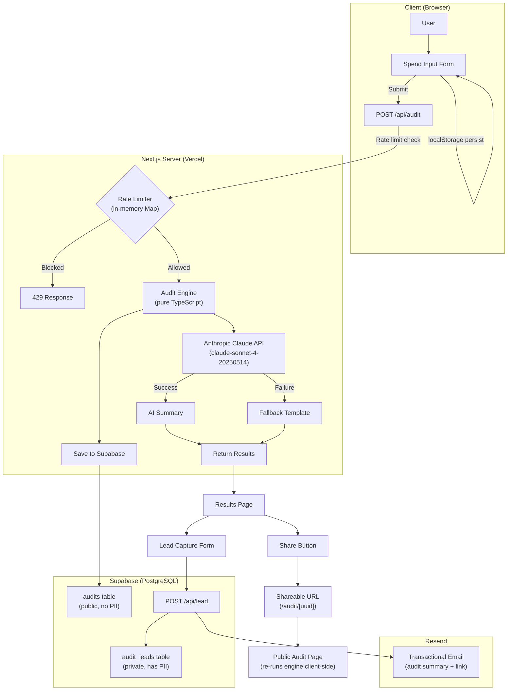

# Architecture — SpendLens

## System Diagram



## Data Flow

```
Input → Audit Logic → AI Summary → Storage → Email → Shareable URL

1. User selects tools, plans, seats, use case
2. Form data POST to /api/audit
3. Rate limit + honeypot check
4. Audit engine runs 4-pass analysis:
   - Pass 1: Plan fit check (is plan appropriate for team size?)
   - Pass 2: Same-vendor downgrade (cheaper plan from same vendor?)
   - Pass 3: Cross-tool alternative (cheaper tool for use case?)
   - Pass 3b: Redundancy detection (overlapping tools?)
   - Pass 4: Credex credits flag (spend > $200?)
5. Anthropic Claude generates personalized summary (~100 words)
6. If Claude fails → deterministic fallback template (never crashes)
7. Audit saved to Supabase `audits` table (no PII)
8. Results rendered client-side
9. User optionally saves report (lead capture)
10. Lead saved to Supabase `audit_leads` table (has PII)
11. Transactional email sent via Resend
12. Shareable URL generated: /audit/[uuid]
```

## Why Next.js + Supabase + Resend

### Next.js (App Router)
- **Server Components** for the shared audit page (SSR with dynamic OG tags)
- **API Routes** for audit logic, lead capture, and AI summary
- **Edge-ready** deployment on Vercel
- TypeScript-first with excellent DX

### Supabase
- **Free tier** supports 500MB storage, 2GB bandwidth — plenty for MVP
- **PostgreSQL** with full SQL support (no NoSQL compromises)
- **Row-level security** potential for future auth features
- **Real-time** capabilities if we add dashboards later

### Resend
- **Free tier** allows 100 emails/day — sufficient for launch
- **React email templates** supported (future upgrade path)
- **Deliverability** is excellent — important for lead nurturing
- **Simple API** — one function call to send

### Anthropic Claude
- **claude-sonnet-4-20250514** offers high-quality writing at reasonable cost
- **Deterministic fallback** means the app never breaks if AI is unavailable
- **10-second timeout** prevents slow API calls from blocking the user

## Scaling to 10k Audits/Day

At 10k audits/day, several changes would be needed:

### Rate Limiting
- **Current:** In-memory Map (resets on deploy, single-instance only)
- **Upgrade:** Upstash Redis with sliding window rate limiting
- **Why:** Distributed rate limiting across Vercel edge functions

### Database
- **Add indexes:** `audits.created_at`, `audit_leads.email`, `audit_leads.created_at`
- **Connection pooling:** Supabase's built-in PgBouncer + connection pool mode
- **Consider:** Read replicas for the public audit page queries

### Caching
- **Audit results:** Cache by `tools_json` hash for 24 hours (many users have similar stacks)
- **AI summaries:** Cache by audit fingerprint — similar inputs get similar summaries
- **OG images:** CDN-cache generated OG images with long TTLs

### Edge Functions
- **Move audit engine** to Edge Runtime (it's pure TypeScript, no Node.js deps)
- **Benefit:** Sub-50ms latency globally vs. ~200ms from a single region

### Monitoring
- **Instrument:** Audit completion rate, AI summary success rate, email delivery rate
- **Alerts:** Rate limit hit rate, API error rate, DB query latency

### Cost Estimate at 10k/day
- **Supabase:** ~$25/mo (Pro plan)
- **Anthropic:** ~$30/mo (10k × ~200 tokens/request)
- **Resend:** ~$20/mo (if 30% of users save reports)
- **Vercel:** ~$20/mo (Pro plan)
- **Total:** ~$95/mo
